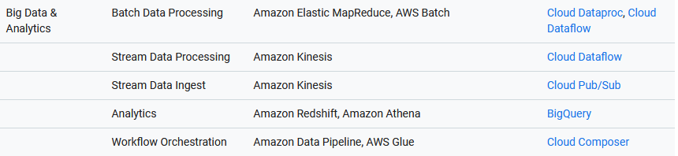
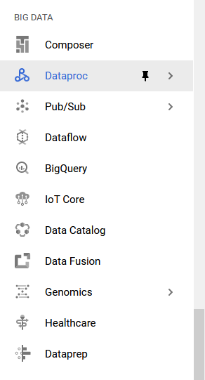
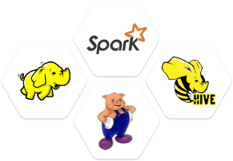
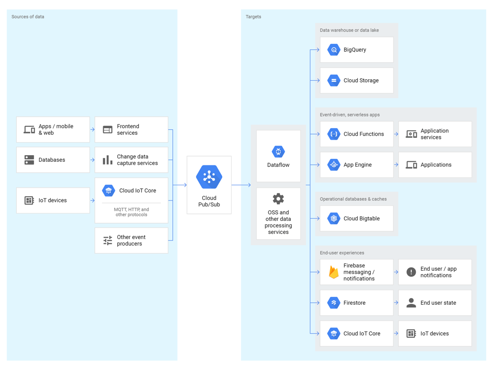
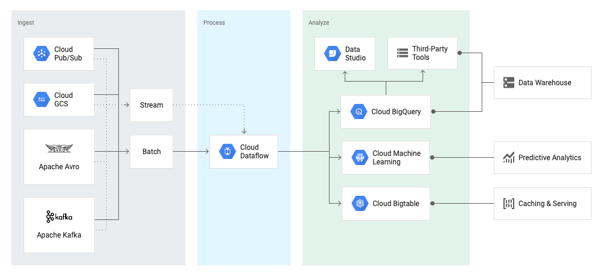
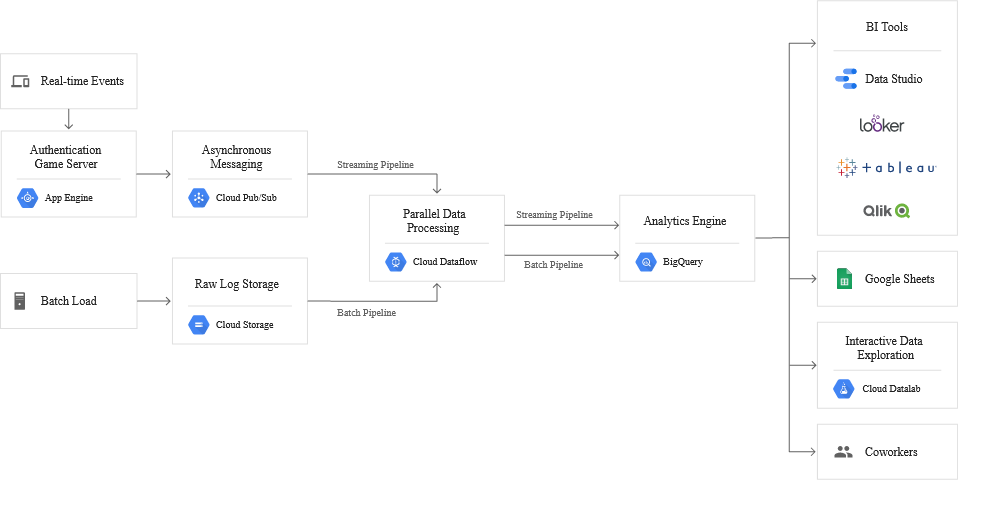
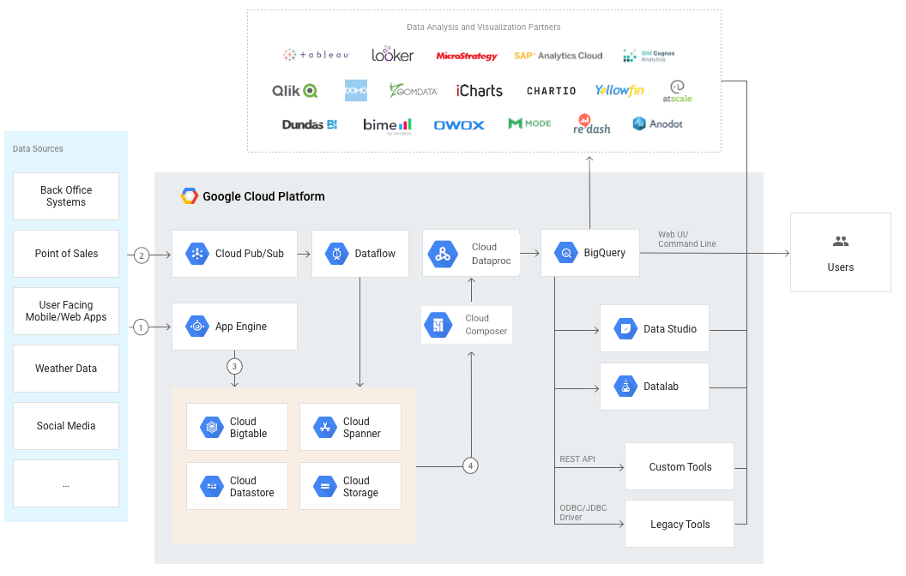

#  Cloud ONLINE:  

http://google.hftty.cn/index.php    

# GoogleCloudPlatform-PCA   

#  GoogleCloudPlatform-DataScience

#  **aws vs gcp on bigdata** 

##  dataProc [hadoop/spark]

##  pub/sub

##  dataFlow [Apache Beam]

##  bigQuery

-----------

##  how diffcult is gcp-Professional Cloud Architect      
https://help.acloud.guru/hc/en-us/articles/360000487816-How-difficult-is-Google-s-Professional-Cloud-Architect-PCA-certification-exam    

##  Google Cloud的专业架构师和专业云工程师认证经验分享   

https://blog.csdn.net/sxb0841901116/article/details/87713664    
